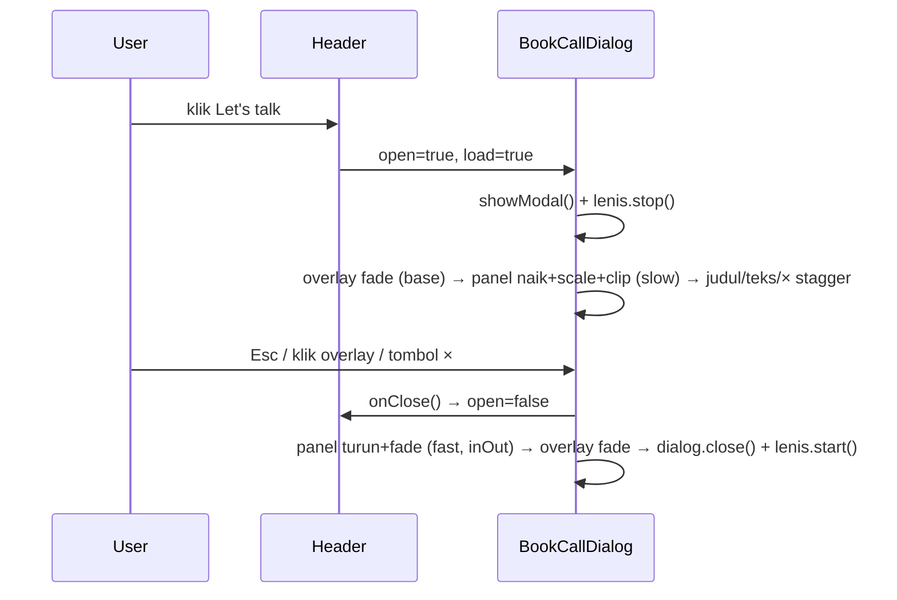

# Popup "Book a call" dari tombol header

Tombol **Let's talk** di header sekarang buka popup berisi kalender Calendly
(`components/ui/BookCallDialog.tsx`), bukan pindah ke /contact.

## Kenapa bukan snippet badge Calendly
Snippet dari Calendly (`initBadgeWidget`) bikin tombol mengambang di pojok
kanan bawah, plus popup bawaan Calendly yang animasinya nggak bisa diatur.
Rizki minta animasi masuk/keluar yang "sebagus mungkin", jadi popup-nya
dibikin sendiri:
- **`<dialog>` bawaan + `showModal()`.** Fitur aksesibilitas langsung
  dapat tanpa nulis kode: fokus pindah ke dalam, Tab nggak bisa keluar
  popup, halaman di belakang jadi inert, dan fokus balik ke tombol
  pemicu waktu ditutup (sudah dites: fokus kembali ke "Let's talk").
- Isinya `CalendlyEmbed` yang sama dengan halaman Contact.

## Animasi (GSAP, nilai dari `lib/motion.ts`)

- **Masuk:** overlay blur gelap fade in. Panel naik dari `y:80`,
  `scale:0.94`, dan `clip-path` dari inset membulat ke penuh, jadi panel
  kelihatan "mekar" dari bawah. Sesudah itu judul, deskripsi, tombol ×,
  dan area kalender muncul bergantian (`[data-reveal]`, stagger token).
- **Keluar lebih cepat dari masuk** (aturan PRD): `duration.fast` + ease
  inOut.
- **Semua cara nutup lewat animasi.** Esc memicu event `cancel`, lalu
  `preventDefault()` supaya dialog nggak langsung hilang, baru minta
  parent set `open=false`. `dialog.close()` baru dipanggil di
  `onComplete` animasi keluar.
- **Lenis di-stop** selama popup terbuka, supaya halaman di belakang
  nggak ikut ke-scroll.
- **Reduced motion:** cuma fade, tanpa gerak/scale/clip.

## Gotcha yang ketemu
1. **Klik tetap pindah halaman ke /contact.** `PageTransitions` dengerin
   semua klik `<a>` di **capture phase**, jadi jalan sebelum `onClick` milik
   Link. Akibatnya `preventDefault` kita telat. Fix-nya di sumbernya
   (`PageTransitions.tsx`): link yang punya `aria-haspopup` di-skip, karena
   link pembuka popup bukan navigasi. `href="/contact"` tetap ada sebagai
   fallback tanpa JS, dan Cmd/Ctrl+klik tetap buka tab baru.
2. **Calendly nggak dimuat di tiap halaman.** `load` baru jadi `true` waktu
   popup pertama kali dibuka dan nggak pernah di-reset. Jadi iframe-nya
   dibuat sekali, dan buka berikutnya langsung muncul.
3. **Spinner Calendly berantakan** tanpa `widget.css`. Sekarang di-load
   lewat `<link rel="stylesheet" precedence="default">`; React 19
   memindahkannya ke `<head>` sekali saja. Spinner-nya `position:absolute`,
   jadi div embed harus `relative` (class resmi Calendly biasanya yang
   ngasih ini).
4. **Liquid cursor & popup.** `<dialog>` modal tampil di *top layer*,
   selalu di atas elemen apa pun termasuk cursor kita (z-index nggak
   ngaruh). Jadi di dalam `dialog[open]` liquid cursor disembunyikan dan
   cursor bawaan dikembalikan (`globals.css`).

## Cara ngetes (dipakai di sesi ini)
Nggak ada Puppeteer/Playwright. Chrome dikendalikan langsung lewat DevTools
Protocol pakai `WebSocket` bawaan Node 26: klik tombol, screenshot
beberapa frame, tekan Esc, lalu cek `dialog.open`, `location.pathname`,
dan `document.activeElement`.

## Revisi: popup pas, nggak bisa di-scroll lagi
Masalah: panel tingginya `min(760px, 90svh)`, dikurangi baris judul
(~110px), jadi ruang buat kalender lebih kecil dari tinggi asli Calendly
(700px). Akibatnya kalendernya bisa di-scroll di dalam panel.
- **Layout 2 kolom di desktop:** info (judul, deskripsi, chip 30 min /
  Google Meet, tombol ×) di kolom kiri 280px, kalender di kanan. Tinggi
  panel = tinggi kalender = **700px**. Diukur lewat CDP: `panelScroll: 0`,
  sebelum dan sesudah milih tanggal.
- **`hide_event_type_details=1`** di URL: kolom detail Calendly (nama
  event, durasi) disembunyikan karena sudah ada di kolom kiri kita. Ini
  juga dipakai di halaman Contact.
- Tombol × dipindah ke kolom info, supaya nggak nutup pita "Powered by
  Calendly" di pojok kalender.
- **Sempat coba `resize: true`** (opsi `initInlineWidget`: iframe ngirim
  `calendly.page_height`, lalu div menyesuaikan tinggi). Ternyata setelah
  milih tanggal, Calendly melebarkan widget jadi **2009px** (semua slot jam
  ditampilkan), jadi panel malah ke-scroll. Akhirnya **balik ke tinggi
  tetap 700px**: tampilan tanggal pas, dan daftar jam ke-scroll di kolom
  Calendly sendiri. Itu desain asli Calendly.
- Panel tetap `overflow-y-auto` + `data-lenis-prevent` sebagai fallback di
  layar yang lebih pendek dari ~760px (HP, laptop kecil).

## Keterbatasan yang diketahui
Setelah user klik sesuatu di dalam kalender, fokus pindah ke iframe
Calendly (beda domain). Tombol **Esc** dikirim ke iframe, bukan ke halaman
kita, jadi event `cancel` dialog nggak terpicu. Ini batasan keamanan
browser untuk iframe lintas domain, nggak bisa diakali. Popup tetap bisa
ditutup lewat tombol × atau klik area gelap.

## Revisi: tombol × di pojok kanan atas, nempel di border
- × sekarang lingkaran hitam (`bg-ink`) yang nangkring di sudut kanan atas
  panel, setengahnya keluar dari tepi (`-top-3 -right-2`, di desktop
  `-top-4 -right-4`).
- Supaya bisa keluar dari tepi, struktur panel dipecah dua:
  - `panelRef` = wrapper luar yang dianimasikan GSAP, isinya tombol ×.
  - Di dalamnya ada kotak putih yang membulat + `overflow-y-auto`. Kalau
    tombolnya ditaruh di sini, bagian yang keluar tepi bakal kepotong oleh
    overflow.
- **Gotcha:** animasi masuk pakai `clip-path` di wrapper. Kalau dibiarkan
  di akhir animasi, clip-path itu motong tombol × yang keluar tepi. Jadi
  ditambah `clearProps: "clipPath"`: clip-path cuma dipakai selama
  animasi, lalu dihapus.
- Kolom info sekarang nggak perlu padding kanan ekstra buat tombol.

## Revisi: × harus utuh dari awal animasi
Rizki lapor: tombol × muncul setengah dulu, baru utuh setelah kalendernya
muncul. Penyebabnya, `clip-path` animasi masuk ada di wrapper luar, dan
wrapper itu juga berisi ×. Selama animasi (1,2 detik), bagian × yang
keluar tepi ikut terpotong. Clip baru dihapus (`clearProps`) di akhir.
- Animasi dipecah dua lapis:
  - **wrapper** (`panelRef`, isinya ×): naik + scale + fade.
  - **kotak putih** (`boxRef`): efek "mekar" pakai `clip-path`, jalan
    bersamaan (posisi `"<"` di timeline).

  Clip-path cuma motong kotak putih, nggak pernah motong ×. `clearProps`
  jadi nggak perlu lagi.
- × juga **dikeluarkan dari reveal bertahap** (`data-reveal` dihapus):
  sekarang muncul utuh bareng panel, bukan nyusul.
- Dicek lewat 4 screenshot CDP di 150 sampai 950 ms setelah klik: × bulat
  utuh di semua frame.
- Pelajaran umum: **jangan taruh `clip-path`/`overflow-hidden` di elemen
  yang punya anak yang sengaja keluar tepi.** Taruh di lapisan yang
  memang mau dipotong.

## Revisi: popup dipicu dari menu, header balik jadi link
Mengikuti referensi menu upsunday:
- **Header "Let's talk"** sekarang balik jadi `<Link>` biasa ke
  `/contact`. Nggak ada lagi `onClick`/`aria-haspopup`. Pengecualian
  `aria-haspopup` di `PageTransitions.tsx` juga dihapus karena sudah nggak
  ada link pembuka popup.
- **Kartu hitam di menu** disusun ulang: label "START A PROJECT", email
  besar, baris "WhatsApp +62 896-7046-8240", tombol putih full-width
  **"BOOK A CALL"** dengan ikon video (`VideoIcon`, sekarang ada di
  `icons.tsx` dan dipakai juga di halaman Contact), lalu baris bawah:
  "Based in Jakarta…" + ikon LinkedIn/GitHub (URL masih `#`).
- Tombol itu manggil `onBookCall` dari Header: tutup menu → **fokus
  dipindah dulu ke tombol Menu** → buka dialog. Urutannya penting.
  `<dialog>` ngembaliin fokus ke elemen yang fokus waktu dibuka. Kalau
  itu tombol di dalam menu yang sudah disembunyikan, fokusnya hilang ke
  elemen yang nggak kelihatan.
- Dites lewat CDP: menu kebuka → klik Book a call → dialog `open: true`,
  menu `aria-hidden` → klik × → dialog tertutup, fokus di tombol "Menu" →
  klik "Let's talk" → pindah ke `/en/contact`.
