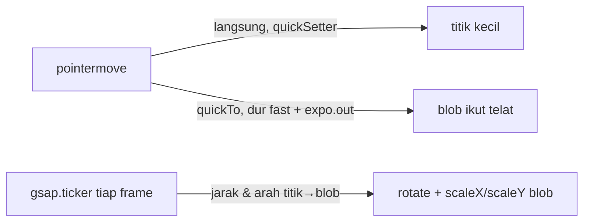

# Liquid cursor

File: `components/motion/LiquidCursor.tsx`, dipasang sekali di
`app/[locale]/layout.tsx`.

## Cara kerjanya

- **Titik** (8px) nempel persis di posisi pointer, jadi klik tetap presisi.
- **Blob** (40px) ngejar pointer pakai `gsap.quickTo` (durasi
  `motionTokens.duration.fast`, ease `expo.out`), jadi selalu sedikit
  telat.
- Efek "liquid": tiap frame dihitung jarak blob ke pointer. Makin jauh,
  makin **melar** (`scaleX` naik, `scaleY` turun), dan diputar
  (`rotation`) searah gerakan. Pas pointer berhenti, jaraknya jadi 0, jadi
  blob balik bulat sendiri. Nggak perlu timeline terpisah.
- Hover link/tombol: blob membesar ×2,4. Kartu project (`data-cursor="hide"`)
  sudah punya pill "View" sendiri, jadi blob & titik disembunyikan biar
  nggak numpuk.
- `mix-blend-mode: difference` + warna putih: cursor membalik warna di
  bawahnya. Jadi hitam di latar off-white, terang di hero biru dan di foto.
  Nggak perlu ganti warna per section.

## Keputusan & gotcha
- **Hanya aktif di `(pointer: fine)` dan tanpa reduced motion** (aturan
  PRD), lewat `gsap.matchMedia`. Di HP atau tablet, atau kalau user
  matiin animasi, cursor bawaan tetap dipakai dan komponen ini nggak
  ngapa-ngapain.
- Cursor bawaan disembunyikan lewat class `has-liquid-cursor` di `<html>`.
  Class-nya **cuma ditambah waktu cursor aktif**, jadi kalau JS gagal,
  cursor bawaan tetap ada. Input/textarea tetap pakai cursor teks (I-beam).
- **Pivot di titik 0×0.** Tiap lapisan (posisi → hover scale → stretch)
  dibungkus div `h-0 w-0` di koordinat pointer, dan bentuk bulatnya
  di-offset negatif. Jadi semua scale/rotate berporos tepat di pointer,
  bukan di pojok elemen.
- Cuma gerakin `transform` & `opacity` (aturan PRD), nggak ada layout
  per frame. `pointer-events-none` supaya cursor nggak nge-block klik.
- Konstanta `STRETCH_PER_PX`, `MAX_STRETCH`, `HOVER_SCALE` itu kenop
  tuning bentuk, bukan nilai waktu. Durasi/easing tetap dari
  `lib/motion.ts`.
- Yang **sengaja nggak dipakai**: filter SVG "gooey" (titik dan blob
  nyambung kayak cairan). Filter itu harus dirender ulang di area besar
  tiap frame, berat buat budget performa PRD. Bisa dicoba kalau efek
  sekarang kurang "cair".

## Revisi 1: rantai tetesan + warna brand
Feedback Rizki: maunya "liquid kecil-kecil mengikuti", dan warnanya jangan
kuning.
- **Kenapa kuning:** `mix-blend-difference` dengan warna putih ngebalik
  warna di bawahnya. Kebalikan biru cobalt (#2F45FF) itu kuning (#D0BA00).
  Jadi blend mode dibuang.
- **Warna sekarang:** `text-accent` + `bg-current` (cobalt). Di atas
  section yang dikasih `data-cursor-theme="light"` (kartu hero biru), root
  cursor dapet `data-theme="light"` → `text-white`. Section gelap lain
  cukup dikasih atribut yang sama.
- **Rantai tetesan:** 8 tetesan (12px → 4px) + titik kepala 16px. Tiap
  tetesan ngejar **tetesan di depannya**, bukan ngejar pointer. Itu yang
  bikin ekornya meliuk kayak cairan. Tiap tetesan juga melar ke arah
  tetesan di depannya. Waktu pointer berhenti, semuanya ngumpul lagi jadi
  satu titik.
- Gerak rantai pakai lerp per frame di `gsap.ticker`, bukan `quickTo`
  per tetesan. `deltaRatio(60)` dipakai supaya kecepatannya sama di layar
  60Hz dan 120Hz. Tanpa itu, di layar 120Hz ekornya jadi 2× lebih pendek.
- Kenop tuning: `DROPLETS` (jumlah & ukuran), `FOLLOW` (makin kecil, ekor
  makin panjang), `STRETCH_PER_PX`, `MAX_STRETCH`, `HOVER_SCALE`.

## Revisi 2: tiga tetes air bening (besar, sedang, kecil)
Feedback Rizki: maunya "bulat besar, bulat sedang, bulat kecil, seperti
air", dan transparan supaya yang di bawahnya tetap kelihatan.
- Jadi **3 tetes**: 36px, 20px, 11px. Yang besar ngejar pointer, yang
  sedang ngejar yang besar, yang kecil ngejar yang sedang. Tiap tetes
  punya `follow` sendiri (0,45 / 0,28 / 0,2), jadi makin kecil makin
  "malas" dan ekornya kelihatan.
- **Efek air, bukan cat:** isinya hampir bening (`bg-white/10`) +
  `backdrop-blur-[2px] backdrop-saturate-150`. Yang di bawah tetes jadi
  sedikit blur dan warnanya lebih hidup, kayak dilihat lewat air. Rim
  putih + highlight putih di kiri-atas + bayangan cobalt tipis bikin
  tetesnya tetap kelihatan di latar off-white maupun hero biru. Jadi
  **logika ganti warna per section (`data-cursor-theme`) dibuang**, nggak
  perlu lagi.
- Hover link/tombol: tetes besar membesar ×1,7, kayak kaca pembesar.
- Gotcha performa: `backdrop-filter` itu mahal, tapi di sini cuma 3
  elemen kecil. Jangan dipakai untuk elemen besar yang gerak tiap frame.
- Nggak ada lagi titik solid di posisi pointer. Pusat tetes besar = posisi
  klik.

## Revisi 3: tetes tetap kelihatan sebagai kumpulan
Rizki kirim screenshot: cuma tetes besar yang kelihatan, lalu dia gambar
tetes sedang dan kecil nempel di kanan-atasnya. Penyebabnya: versi
sebelumnya nutup **seluruh** jarak ke tetes di depannya, jadi pas mouse
berhenti, tetes sedang dan kecil tenggelam persis di bawah tetes besar.
- Sekarang tiap tetes punya **jarak istirahat** (`gaps`) = jumlah jari-jari
  kedua tetes × `GAP` (0,85, sedikit nempel). Tetes cuma maju sejauh
  `jarak − gap`, jadi kalau sudah dekat, dia berhenti di samping, nggak
  numpuk.
- Arahnya ngikutin gerakan terakhir. Tetes kecil selalu di belakang arah
  gerak, kayak ekor tetes air. Waktu pertama muncul, posisinya diagonal
  kanan-atas (`Math.SQRT1_2`), sesuai gambar Rizki.
- Melar sekarang dihitung dari sisa jarak yang masih harus ditempuh
  (`travel`), bukan jarak total. Jadi waktu diam, tetesnya bulat sempurna
  walau posisinya berjejer.
- Kenop: `GAP` (< 1 nempel / overlap, > 1 renggang).

## Revisi 4: balik ke perilaku revisi 2
Setelah dicoba, Rizki lebih suka perilaku revisi 2: tetes sedang dan kecil
ngekor waktu gerak, lalu nyatu ke tetes besar waktu berhenti. Logika jarak
istirahat (`GAP`/`gaps`/`travel`) dihapus. Yang dipertahankan dari revisi 3:
ukuran 36/20/11 px dan rim yang lebih terang (`border-white/80`).

## Revisi 5: blur → zoom (efek lensa tetes air)
Rizki maunya isi tetes nge-zoom (kayak kaca pembesar / tetes air), bukan
nge-blur.
- CSS nggak punya filter "zoom" buat backdrop. Triknya: **filter SVG
  `feDisplacementMap` dipakai sebagai `backdrop-filter: url(#lens-i)`**.
  Displacement map digambar di `<canvas>` 64×64 (channel R = geser X,
  G = geser Y), dan setiap piksel di dalam tetes diambil dari titik yang
  lebih dekat ke pusat. Hasilnya, background di bawah tetes kelihatan
  membesar.
- Rumus: `geser = −(jarak dari pusat) × (1 − 1/ZOOM) × (1 + EDGE_BEND·r²)`.
  Di pusat, perbesarannya = `ZOOM`. Ke arah tepi, tarikannya makin kuat,
  jadi kayak kaca melengkung di pinggir tetes air.
- Satu `<filter>` per ukuran tetes, karena `scale` di feDisplacementMap
  satuannya px.
- Sudah dites di Chrome headless (halaman uji di scratchpad). ZOOM 1.6
  terlalu besar dan kelihatan kotak-kotak. **1.4 + EDGE_BEND 0.35** paling
  enak dilihat.
- Gotcha:
  1. feDisplacementMap ambil piksel terdekat tanpa interpolasi, jadi tepi
     huruf yang di-zoom bergerigi. Ditambah `feGaussianBlur 0.5` buat
     ngehalusin.
  2. Hasil filter agak lembut di layar retina (dihitung di resolusi CSS
     px), wajar untuk efek ini.
  3. Kalau di bawah tetes cuma latar `<body>` (warna canvas), isinya jadi
     putih. Di situs ini aman karena `<main>` punya `bg-bg` sendiri.
  4. **Cuma jalan di Chrome/Edge/Arc.** Safari & Firefox belum dukung
     `backdrop-filter: url()`, jadi di sana tetesnya bening tanpa zoom
     (rim + highlight tetap ada).

## Revisi 6: ikut bereaksi waktu scroll
Waktu scroll, pointer nggak gerak, jadi nggak ada `pointermove` atau
`pointerover`. Akibatnya tetes diam kaku, dan status hover (membesar di
link, sembunyi di kartu) nggak ke-update.
- Listener `scroll` di window. Lenis tetap nge-scroll window, jadi event
  native-nya tetap jalan.
- **Efek cair:** setiap scroll, semua tetes digeser `−delta × SCROLL_DRAG`
  (0,6), seolah kebawa konten. Sesudahnya rantai lerp yang sudah ada narik
  tetes balik ke pointer. Hasilnya tetes melar dan ngekor ke atas/bawah.
  Nggak perlu animasi baru. Pergeseran dibatasi `MAX_SCROLL_DRAG` (80px)
  per event supaya scroll kencang nggak ngelempar tetes keluar layar.
- **Hover tetap benar:** `document.elementFromPoint(pointer)` dicek tiap
  scroll, lalu masuk ke fungsi yang sama dengan `pointerover`
  (`updateHover`).
- `{ passive: true }` supaya listener nggak ngeblok scroll.
