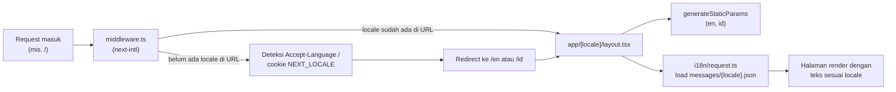

# Fondasi routing bilingual (App Router + next-intl)

## Kenapa `[locale]` harus jadi folder, bukan cuma middleware

- Middleware next-intl jalan duluan, tapi tugasnya cuma **redirect/rewrite**
  request ke path yang ada locale-nya (mis. `/` → `/en`). Ia tidak "menyimpan"
  state bahasa untuk seluruh render.
- Kalau locale cuma disimpan di cookie tanpa muncul di URL:
  - Tidak bisa di-*static generate* per bahasa (SSG butuh path unik per output).
  - Tidak bisa share link `/id/work/dikita-laundry` ke orang lain dan mereka
    otomatis lihat versi Indonesia — mereka akan lihat versi default cookie
    server, bukan sesuai URL.
  - SEO rusak: Google index satu URL yang isinya bisa berubah-ubah tergantung
    cookie, padahal PRD butuh `hreflang` EN/ID sebagai dua URL terpisah yang
    valid.
- Jadi: **URL adalah sumber kebenaran locale** (align sama requirement PRD:
  toggle bahasa tetap di halaman yang sama, `/en/work/dikita` ↔
  `/id/work/dikita`). Middleware cuma menentukan URL awal yang benar saat
  user belum menyebutkan locale eksplisit.

## Bagian yang saling berhubungan

## Miskonsepsi yang perlu diingat (dari Q&A)

- **`[locale]` bukan tempat penyimpanan teks.** Dia cuma parameter/kunci
  (`"en"` atau `"id"`) yang diteruskan ke `i18n/request.ts`. Yang benar-benar
  menyimpan teks adalah `messages/en.json` / `messages/id.json`; `i18n/request.ts`
  yang fetch file itu berdasarkan kunci dari `[locale]`.
- **Middleware bukan connector antar halaman.** Dia cuma nyala satu kali di
  titik masuk — saat URL belum punya prefix locale sama sekali (`/`,
  `/about`). Begitu user sudah berada di `/id/...` dan navigasi ke halaman
  lain di locale yang sama, itu murni App Router routing biasa; middleware
  tidak ikut campur lagi. Analogi: middleware = penjaga gerbang di pintu
  masuk pertama, bukan jembatan yang dilewati tiap kali pindah halaman.

## Status pembelajaran
- [x] Paham kenapa locale harus di URL, bukan cuma cookie.
- [x] Paham beda peran `[locale]` (kunci) vs `messages/*.json` (penyimpanan)
      vs middleware (penjaga gerbang pintu masuk).
- [x] Implementasi jalan: `middleware.ts`, `app/[locale]/layout.tsx`,
      `app/[locale]/page.tsx`, `i18n/request.ts`, `messages/en.json` +
      `messages/id.json`, `next.config.ts`.

## Bug yang ketemu pas implementasi (dan kenapa)

1. **404 di `/en`** — `layout.tsx` cuma bungkus, bukan isi. App Router butuh
   `page.tsx` di segment yang sama supaya route punya konten yang di-render.
   Layout tanpa page = kamar tanpa isi.
2. **`i18n/request.ts` nggak pernah kepanggil** — lupa wrap `next.config.ts`
   dengan `createNextIntlPlugin()`. Tanpa ini Next.js nggak tau harus jalanin
   config next-intl sebelum render.
3. **`createNextIntlPlugin` vs `createNextIntlPlugin()`** — factory function
   vs hasil panggilannya. Tanpa `()`, variabel `withNextIntl` jadi *fungsi
   pembuatnya sendiri*, bukan wrapper yang siap pakai. Efeknya: `nextConfig`
   (object) ke-pass sebagai argumen ke `createNextIntlPlugin`, padahal itu
   ekspektasinya path/opsi plugin — mismatch tipe, error nggak jelas kalau
   nggak ngerti akar masalahnya. Pelajaran umum: kalau sebuah nama fungsi
   "factory" dipakai tanpa `()`, curigai itu duluan.
4. **File scaffold lama (`app/layout.tsx`, `app/page.tsx`) harus dihapus**
   begitu pindah ke struktur `app/[locale]/`, karena dua-duanya sama-sama
   define `<html><body>` → bentrok (nested html tags) kalau dibiarkan.

## Next
- Lanjut ke topik berikutnya: kemungkinan design tokens (Tailwind v4 +
  CSS variables sesuai PRD) atau `lib/motion.ts` (motion tokens GSAP).
